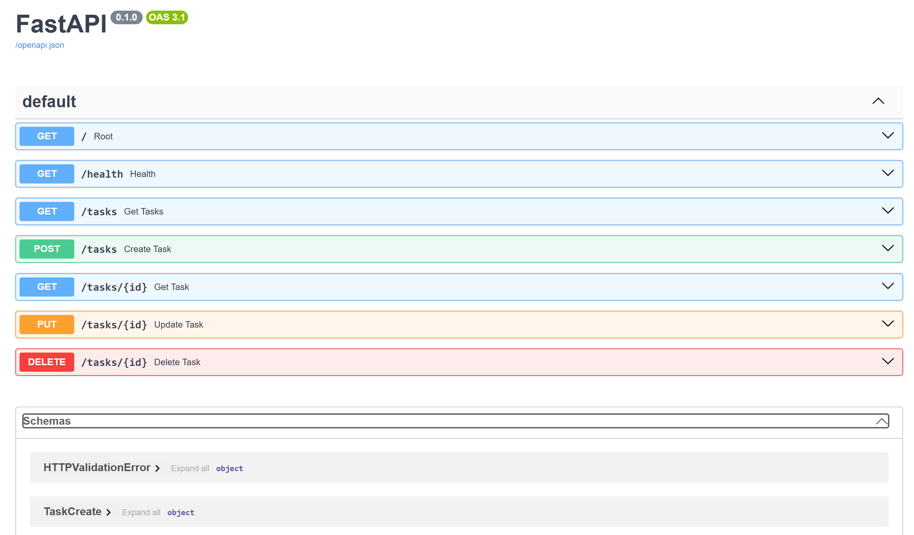

# Task API

A simple REST API for managing tasks, built with Python and FastAPI.

This project was created as part of the FlyRank internship task. It demonstrates the basic CRUD operations:

- Create tasks
- Read tasks
- Update tasks
- Delete tasks

The API stores tasks in memory while the server is running.

---

## Features

- FastAPI REST API
- In-memory task storage
- Create, read, update, and delete tasks
- Input validation
- Proper HTTP status codes
- Automatic Swagger UI documentation

---

## Requirements

- Python 3.13
- FastAPI
- Uvicorn

---

## Installation

Clone the repository:

```bash
git clone https://github.com/haneen09/flyrank.api.task.git
cd flyrank.api.task
```

Create and activate a virtual environment:

```powershell
python -m venv venv
venv\Scripts\Activate.ps1
```

Install the dependencies:

```powershell
pip install fastapi "uvicorn[standard]"
```

---

## Running the API

Start the development server:

```powershell
python -m fastapi dev main.py
```

The API will be available at:

```text
http://127.0.0.1:8000
```

Swagger UI is available at:

```text
http://127.0.0.1:8000/docs
```

---

## API Endpoints

| Method | Endpoint | Description |
|---|---|---|
| GET | `/` | Returns basic information about the Task API |
| GET | `/health` | Checks whether the API is running |
| GET | `/tasks` | Returns all tasks |
| GET | `/tasks/{id}` | Returns a single task by ID |
| POST | `/tasks` | Creates a new task |
| PUT | `/tasks/{id}` | Updates an existing task |
| DELETE | `/tasks/{id}` | Deletes a task |

---

## Example: Health Check

### Request

```bash
curl -i http://127.0.0.1:8000/health
```

### Response

```text
HTTP/1.1 200 OK
date: Sun, 16 Aug 2026 14:23:10 GMT
server: uvicorn
content-length: 15
content-type: application/json

{"status":"ok"}
```

---

## Example Task

A task has the following structure:

```json
{
  "id": 1,
  "title": "Read a book",
  "done": false
}
```

When creating a task, only the title is required:

```json
{
  "title": "Go for a walk"
}
```

The API automatically assigns the ID and sets `done` to `false`.

---

## CRUD Operations

### Create

```text
POST /tasks
```

Example request:

```json
{
  "title": "Read a new book"
}
```

Returns `201 Created`.

### Read

```text
GET /tasks
GET /tasks/{id}
```

Returns the requested task or tasks.

### Update

```text
PUT /tasks/{id}
```

Example request:

```json
{
  "title": "Read a whole book",
  "done": true
}
```

Returns `200 OK`.

### Delete

```text
DELETE /tasks/{id}
```

Returns `204 No Content` when successful.

---

## Error Handling

The API returns appropriate HTTP status codes for invalid requests.

- `400 Bad Request` — missing or empty task title
- `404 Not Found` — task does not exist
- `201 Created` — task successfully created
- `204 No Content` — task successfully deleted

---

## Swagger UI

The API includes automatically generated interactive documentation using FastAPI's Swagger UI.

Open:

```text
http://127.0.0.1:8000/docs
```

All API endpoints can be tested directly through Swagger UI.

### Swagger Screenshot



---

## Project Structure

```text
flyrank-task1/
├── main.py
├── README.md
├── swagger.png
└── venv/
```

---

## GitHub Repository

https://github.com/haneen09/flyrank.api.task